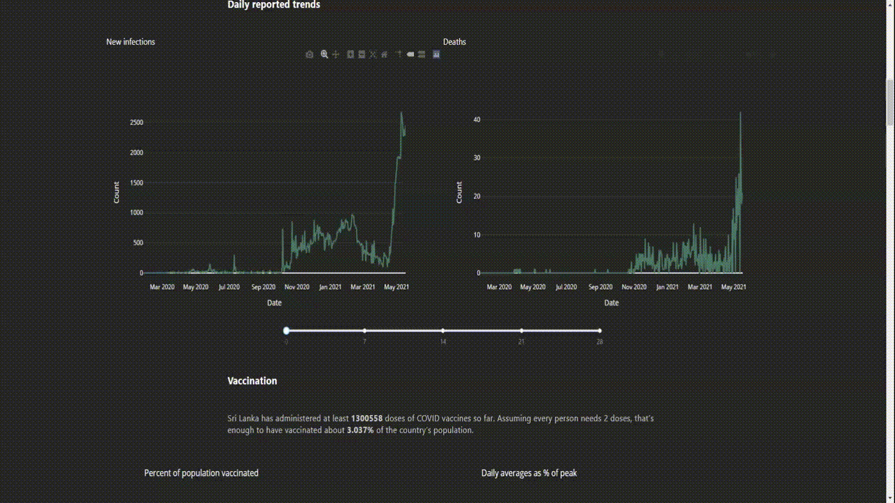

# sri lanka covid-19 situation dashboard

analysis repo - 'https://github.com/ashen007/SL_COVID_analysis' 
dashboard - 'https://sl-covid19-dashboard.herokuapp.com'

## Data collection and Research

- Ashen Iranga Hewarathna
- Amila Prasanga Munasingha

## Data collection

Our main data source was the our world data set about covid-19. we filter sub part of that data set which relevant to
sri lanka. we use arbittery imputation method to fill na values before first case recorded. there is also irregularities
in this data may be because some records didn't release daily basis. in that scenario we use forward filling imputation
method. we used government daily records reports which are in pdf format for get data about how cases distribute through
districts and also hospital data. we use some local and international media reports getting more data on lockdowns and
travel restrictions.

## What are we trying to do?

we mainly try to find how lockdowns effect to spread of virus and how pandemic effect commiunity in education and
economy also how we can accomplish fully vaccination. then we compare sri lankan situation with the region and all over
the world. we drill down local situation into districts and clusters.

#### note: 
Some times country officials change reporting to include or exclude a certain category of infections or deaths, 
which can lead to a significant increase or decrease in total and what they reported previously. specially in district
data.

## How to run this project on local machine
if you want to run this project on your local machine you need few libraries:
* numpy
* pandas
* flask
* plotly
* dash
* statmodel

## Data Sources

* OWID repository - https://github.com/owid/covid-19-data/tree/master/public/data
* epidemiology unit ministry of health sri lanka
    - https://www.epid.gov.lk/web/index.php?option=com_content&view=article&id=225&Itemid=518&lang=en
* health promotion bureau - https://hpb.health.gov.lk/en/api-documentation
* world bank - https://data.worldbank.org/?type=shaded
* wikipedia - https://en.wikipedia.org/wiki/COVID-19_pandemic_in_Sri_Lanka
* A3M - https://global-monitoring.com/gm/page/events/epidemic-0002015.fTDtGCxti2qN.html?lang=en
* Jhons Hopkins coronavirus resoures center - https://coronavirus.jhu.edu/region/sri-lanka
* local media reports -  
    - newsFirst https://www.newsfirst.lk/?s=covid 
    - adaDerana http://www.adaderana.lk/search_results.php?mode=2&show=1&query=lockdown 
  
## How to get more insight for plots

you can turn multi level graph in to single level :

* turn off graph by click in legend.

  
* zoom in by dragging

  
* to get hover labels in  multiple layer

